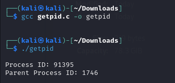
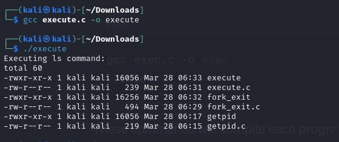

# Linux-Process-API-fork-wait-exec-
Ex02-Linux Process API-fork(), wait(), exec()
# Ex02-OS-Linux-Process API - fork(), wait(), exec()
Operating systems Lab exercise


# AIM:
To write C Program that uses Linux Process API - fork(), wait(), exec()

# DESIGN STEPS:

### Step 1:

Navigate to any Linux environment installed on the system or installed inside a virtual environment like virtual box/vmware or online linux JSLinux (https://bellard.org/jslinux/vm.html?url=alpine-x86.cfg&mem=192) or docker.

### Step 2:

Write the C Program using Linux Process API - fork(), wait(), exec()

### Step 3:

Test the C Program for the desired output. 

# PROGRAM:

```
 Developed by       : Guttha Keerthana
 Registration Number: 212223240045
```
## C Program to print process ID and parent Process ID using Linux API system calls
getpid.c
```
#include <stdio.h>
#include <unistd.h>

int main() {
    pid_t pid = getpid();
    pid_t parent_pid = getppid();

    printf("Process ID: %d\n", pid);
    printf("Parent Process ID: %d\n", parent_pid);

    return 0;
}
```
##OUTPUT



## C Program to create new process using Linux API system calls fork() and exit()
fork_wait.c
```
#include <stdio.h>
#include <stdlib.h>
#include <unistd.h>
#include <sys/wait.h>

int main() {
    pid_t pid = fork();

    if (pid == -1) {
        perror("fork");
        exit(EXIT_FAILURE);
    }

    if (pid == 0) {
        // Child process
        printf("Child Process: PID = %d, Parent PID = %d\n", getpid(), getppid());
        exit(EXIT_SUCCESS);
    } else {
        // Parent process
        printf("Parent Process: PID = %d\n", getpid());
        wait(NULL);
    }

    return 0;
}
```

##OUTPUT


## C Program to execute Linux system commands using Linux API system calls exec() family

execute.c
```
#include <stdio.h>
#include <stdlib.h>
#include <unistd.h>

int main() {
    printf("Executing ls command:\n");
    execl("/bin/ls", "ls", "-l", NULL);
    perror("execl");
    return 0;
}
```
##OUTPUT




# RESULT:
The programs are executed successfully.
